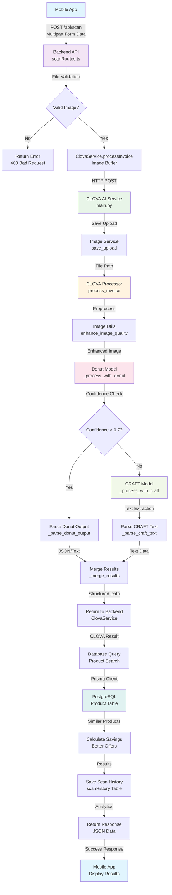
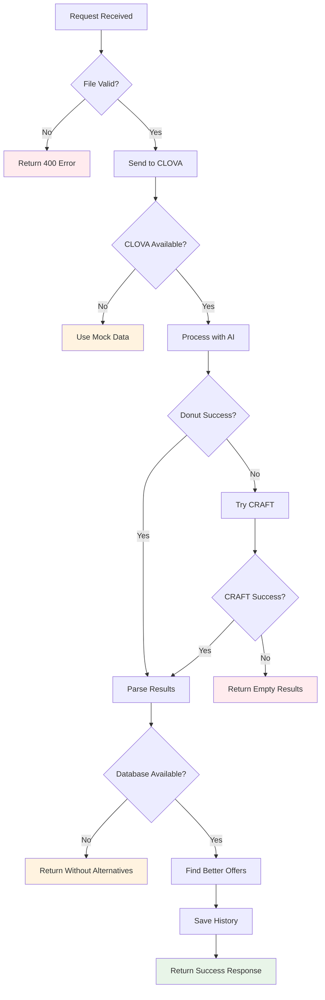

# 🔄 CLOVA AI Invoice Scanner - Scan API Flow Diagram

## 📊 Complete Process Flow



## 🔍 Detailed Step-by-Step Breakdown

### **Step 1: Request Reception**
```
Mobile App → Backend API (scanRoutes.ts)
├── File: backend/src/routes/scanRoutes.ts
├── Method: POST /api/scan
├── Middleware: Multer (file upload)
└── Validation: Image type, size (10MB)
```

### **Step 2: CLOVA Service Communication**
```
Backend → CLOVA AI Service
├── File: backend/src/services/ClovaService.ts
├── Method: HTTP POST to CLOVA service
├── Data: Image buffer via FormData
└── Timeout: 60 seconds
```

### **Step 3: Image Processing Pipeline**
```
CLOVA Service → Image Processing
├── File: clova-service/app/services/image_service.py
├── Action: Save uploaded file
├── File: clova-service/app/utils/image_utils.py
└── Enhancement: CLAHE, denoising, resizing
```

### **Step 4: AI Model Processing**
```
Image → AI Models
├── Primary: Donut Model (Document Understanding)
│   ├── File: clova-service/app/services/clova_processor.py
│   ├── Model: naver-clova-ix/donut-base-finetuned-cord-v2
│   └── Output: Structured JSON/Text
└── Fallback: CRAFT Model (Text Detection)
    ├── File: clova-service/app/services/clova_processor.py
    ├── Purpose: OCR when Donut fails
    └── Output: Raw text extraction
```

### **Step 5: Data Parsing & Structuring**
```
AI Output → Structured Data
├── JSON Parsing: Extract items, prices, quantities
├── Text Parsing: Regex patterns for unstructured data
├── Confidence Scoring: Quality assessment
└── Data Validation: Ensure required fields
```

### **Step 6: Database Query & Alternative Search**
```
Structured Data → Database
├── File: backend/src/services/DatabaseService.ts
├── Query: Find similar products with better prices
├── Filters: Name matching, price comparison
└── Include: Shop information, ratings
```

### **Step 7: Result Aggregation**
```
Database Results → Final Response
├── Calculate: Savings amount and percentage
├── Format: Better offers with shop details
├── Save: Scan history for analytics
└── Return: Structured JSON response
```

## 📁 File Interaction Matrix

| Step | Primary File | Supporting Files | Purpose |
|------|-------------|------------------|---------|
| 1 | `scanRoutes.ts` | `errorHandler.ts`, `logger.ts` | Request handling & validation |
| 2 | `ClovaService.ts` | `config/index.ts` | Service communication |
| 3 | `image_service.py` | `image_utils.py` | File management & preprocessing |
| 4 | `clova_processor.py` | `main.py` | AI model orchestration |
| 5 | `clova_processor.py` | `models/invoice.py` | Data parsing & validation |
| 6 | `DatabaseService.ts` | `prisma/schema.prisma` | Database operations |
| 7 | `scanRoutes.ts` | `logger.ts` | Response formatting & logging |

## ⚡ Performance Timeline



```mermaid
gantt
    title Scan API Processing Timeline
    dateFormat X
    axisFormat %s
    
    section Request Processing
    File Upload          :0, 1
    Validation           :1, 1.5
    
    section AI Processing
    Image Preprocessing  :1.5, 2
    Donut Model         :2, 4
    CRAFT Fallback      :4, 5.5
    
    section Database
    Product Search       :5.5, 6
    History Save        :6, 6.5
    
    section Response
    Result Aggregation  :6.5, 7
    Response Return     :7, 7.5
```

## 🔄 Error Handling Flow



## 🎯 Key Decision Points

### **1. File Validation**
- **Condition**: File type must be image, size < 10MB
- **Action**: Reject invalid files immediately
- **Error**: 400 Bad Request with specific message

### **2. CLOVA Service Availability**
- **Condition**: CLOVA service responds within timeout
- **Action**: Use real AI processing or fallback to mock data
- **Logging**: Warning when fallback is used

### **3. AI Model Confidence**
- **Condition**: Donut confidence score > 0.7
- **Action**: Use Donut results or trigger CRAFT fallback
- **Threshold**: Configurable confidence threshold

### **4. Database Availability**
- **Condition**: Database connection and query success
- **Action**: Find alternatives or return without them
- **Graceful**: Continue processing even if DB fails

## 📊 Data Transformation Flow

```
Raw Image (JPEG/PNG)
    ↓
Image Buffer (Node.js)
    ↓
File Upload (Python)
    ↓
Enhanced Image (OpenCV)
    ↓
AI Model Input (PyTorch)
    ↓
Structured Output (JSON/Text)
    ↓
Parsed Items (TypeScript)
    ↓
Database Query (Prisma)
    ↓
Better Offers (Calculated)
    ↓
Final Response (JSON)
```

## 🔧 Configuration Points

### **Backend Configuration**
```typescript
// File: backend/src/config/index.ts
{
  clovaService: {
    url: "http://localhost:8000",
    timeout: 60000,
    retries: 3
  },
  upload: {
    maxSize: 10 * 1024 * 1024,
    allowedTypes: ["image/jpeg", "image/png", "image/webp"]
  },
  database: {
    maxConnections: 10,
    queryTimeout: 5000
  }
}
```

### **CLOVA Service Configuration**
```python
# File: clova-service/app/config.py
{
  "confidence_threshold": 0.7,
  "use_fallback": True,
  "max_workers": 2,
  "model_cache_dir": "/app/models",
  "upload_dir": "/app/uploads"
}
```

This flow diagram provides a comprehensive visual representation of the scan API process, showing all the files involved, their interactions, and the decision points throughout the processing pipeline.